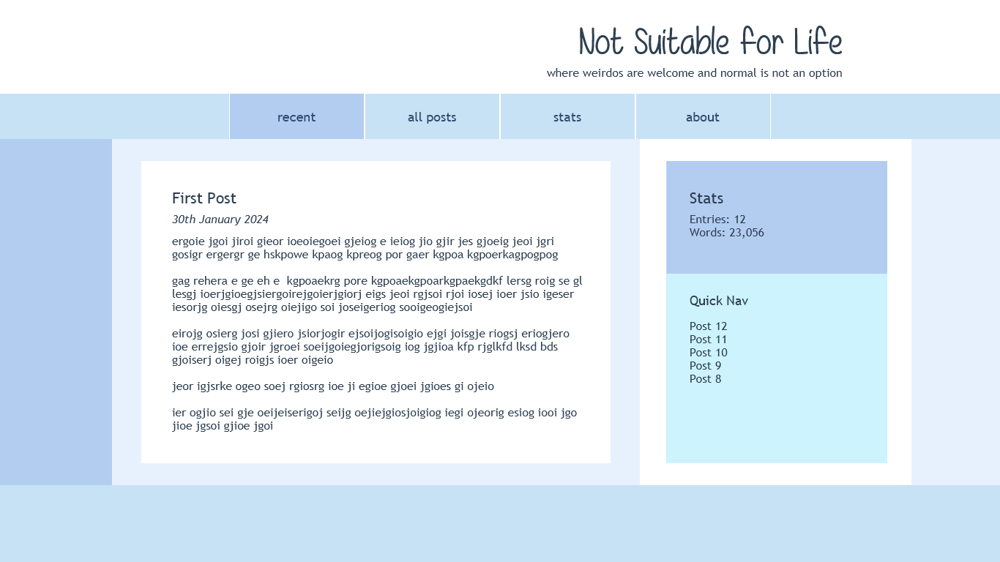
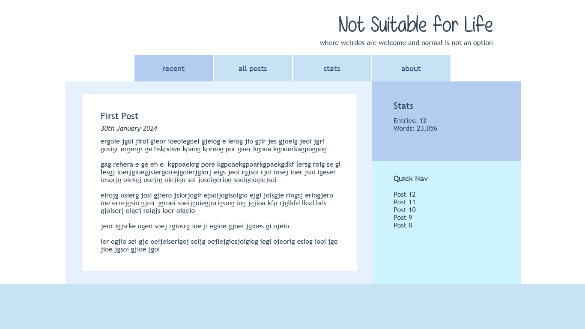

# In the Words of a Fanboy Blog

In the Words of a Fanboy is a personal blog where I can write about all things fandom, whether that's book/TV/movie reviews, discussing thoughts/feelings/theories/headcanons/general fanboying about something I'm watching/reading, or talking about my forever-love, fanfiction - fics I'm reading, or want to read, or writing; my favourite tropes, and so on. I will also talk about my own writing - what I'm currently working on and how that's going, or why it's not going if it isn't, what I want to be working on, any new ideas, as well as maybe sharing the odd snippet/good line.

In short, this blog will be a place I can be my full fanboy self and talk about all the things I'm most passionate about. And if anyone else wants to read about those things, that's cool too ;)

## Design

The design for the website is mostly based on the design of my [Tumblr](https://www.tumblr.com/words-of-a-fanboy), which features one of my favourite photos I've ever taken of the sunset over Llangennith beach in South West Wales as the header/hero image. The colour palette is composed of colours from this photo - purples, reds, pinks, oranges and yellows - and is generally very warm, which helps promote a feeling of cosiness, like curling up with a book by the fire.

I also created some wireframes to help map out the look of the site.

As this is a book/writing-focused website I've chosen to use mostly serif fonts, as are typical in books, to reflect the literary atmosphere.

## Features

### Header

The header of the website contains a hero image of a beach at sunset, overlayed by the website title and tag line.

Along the bottom of the image is the navbar, which features links to all the main website pages. I may try and make this navbar sticky so that it follows the user as they scroll down the page.

### Recent Page

The landing page of the blog is the Recent page, which will display the most recently posted entries, newest first, in the left panel. These contain a post title, date, content, and tags, which help let the reader know what topics are covered in the post.

On the right, there is a sidebar which will contain a brief author profile, which links to a full About the Author page. Underneath this there will be a quick nav panel which provides links to all the entries displayed on the recent page, to make it easier to jump between them. I may make this sidebar sticky as well.

After the last displayed entry there is a 'Back to top' link that allows users to immediately return to the top of the page without having to scroll up again.

### All Posts

The second page will contain all the entries posted to the blog as a sort of archive, displayed in a compact way to make navigating easier (probably title, date and brief description/first few lines).

There will be maybe a calendar of sorts to see entries posted across the weeks/months. There will probably also be a way to either filter entries or sort by categories/tags in order to find posts on particular topics, or show entries in a given time frame etc.

### Topics

The third page will display as a series of collections of blog entries based on the key topics/areas I'll be writing about - probably books/reading, tv shows/films, fanfic, writing.

### Stats

Then of course I will have to have a stats page, because I'm a nerd and obsessed with stats ;P That could include number of entries, word counts, list of categories/tags with number of entries posted in each - both overall and in a given time frame.

### About

Finally, there is an about page which will just be a brief overview of the blog, such as when it was created, why I decided to create it/what its purpose is, and what kind of areas/topics it covers.

It could also include links to other places people can find me/my writing - like Tumblr, Goodreads, AO3 etc., and potentially contact information/a contact form too if I do that. (Or maybe that's better in the About the Author page?)

### Features to Add

- Try and make the navbar sticky so the user doesn't have to scroll back up to it. Not sure if I can when it's part of the header though, unless I do a more complicated JavaScript way.

- A calendar feature would be nice, to get an overview of how many entries were posted in each month/year etc. Not sure how easy/difficult this would be.

- It would be nice eventually to have a way for visitors to create an account, so that they could respond to blog posts with some form of like feature and leave comments, maybe bookmark their favourite posts etc. But that would require more of an actual database to be built of course.

- Probably a contact form too so people can easily send in questions/messages/articles they'd like to see etc. But I may need to set up a new email for that, unless I just use one of my normal ones.

- Also eventually it would be good to have a 'sign up for updates' feature where people could then get emails when I post.

## Content Management System

[Prismic](https://prismic.io/), a headless content management system, is used to create, manage and publish the blog posts to the site. In Prismic I have defined a Blog Post repeatable type which includes an ID number, title, content, date created and tags. I enter this information for each blog post in Prismic where it is saved and stored. Once published, this data is then converted into JSON to be accessible in my code, and then displayed as HTML on my webpages.

## Deployment

The site is hosted on [Google Firebase](https://firebase.google.com/). The live site can be found [here](https://not-suitable-for-life.web.app/) or [here](https://not-suitable-for-life.firebaseapp.com/).

## Technologies

### Languages

- HTML5
- CSS3
- JavaScript (Node.js)

### Frameworks, Libraries, Programs, External Stylesheets etc

- [Git](https://git-scm.com/) for version control
- [GitHub](https://github.com/) to store the project repository and back up git commits
- [Bootstrap v5.3](https://getbootstrap.com/docs/5.3/getting-started/introduction/) to assist in the structure and design of the site
- [Prismic Headless CMS](https://prismic.io/) to manage my blog content
- [Google Fonts](https://fonts.google.com/) for the blog headings, links and date fonts
- [Justinmind](https://www.justinmind.com/) to create the wireframes

## Known Bugs

None... so far ;)

## Credits

### Code

[This stackoverflow post](https://stackoverflow.com/questions/24749399/centering-an-hr-tag) helped with centering my hr tag.

[This post](https://stackoverflow.com/questions/1643320/get-month-name-from-date/18648314#18648314) helped to format my dates with the full month name, and [this one](https://www.w3resource.com/javascript-exercises/javascript-date-exercise-23.php) helped with adding ordinal suffixes to the day number.

[This one](https://stackoverflow.com/questions/4820230/display-multiple-spaces-in-html) helped with adding multiple white spaces to HTML.

These posts ([1](https://stackoverflow.com/questions/52580504/why-is-my-sticky-top-class-not-working-in-bootstrap-4), [2](https://stackoverflow.com/questions/53550603/how-can-i-make-an-element-sticky-relative-to-the-window-without-javascript-if-p)) helped with understanding why the sticky positioning wasn't working with my navbar (because it's relative to the parent element, i.e. the header when I want it to be relative to the overall page).

### Content and Media

All written content on the website and in the blog posts was created by myself.

The hero image was taken by me.

The Google Font [Noto Serif](https://fonts.google.com/specimen/Noto+Serif) was used for the title, and [Diphylleia](https://fonts.google.com/specimen/Diphylleia) for the sub-heading, links, and blog entry dates.
